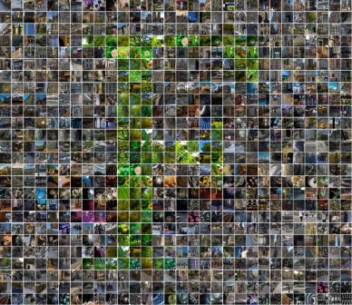

# *<center>Flickr1024: A Large-Scale Dataset for Stereo Image Super-Resolution</center>*

***<center><a href="https://yingqianwang.github.io" target="_blank">Yingqian Wang</a>&emsp; <a href="https://longguangwang.github.io/" target="_blank">Longguang Wang</a>&emsp; Jungang Yang&emsp; Wei An&emsp; <a href="http://yulanguo.me/" target="_blank">Yulan Guo</a></center>*** <br>

### <center></center>

***Flickr1024 is a large-scale stereo image dataset which consists of 1024 high-quality image pairs and covers diverse senarios. Details of this dataset can be found in our <a href="http://openaccess.thecvf.com/content_ICCVW_2019/papers/LCI/Wang_Flickr1024_A_Large-Scale_Dataset_for_Stereo_Image_Super-Resolution_ICCVW_2019_paper.pdf">published paper</a>. Although the Flickr1024 dataset was originally developed for stereo image SR (click [here](https://github.com/YingqianWang/Stereo-Image-SR) for an overview), it was also used for many other tasks such as reference-based SR, stereo matching, and stereo image denoising.***<br><br><br>

## Sample Images

<br><br><br>

## Downloads
* The ***Flickr1024*** dataset can be downloaded via
***<a href="https://pan.baidu.com/s/1YD76gpQ2WjkhjkMnHmU3tQ" target="_blank">Baidu Drive</a>*** or 
***<a href="https://drive.google.com/file/d/1My6oQaHzclxRrKID-mylvs6Z0d5pT_Cu/view?usp=sharing" target="_blank">Google Drive</a>*** <br><br>

## Notations
* The ***Flickr1024*** dataset is available for ***non-commercial*** use only. 
  Therefore, You agree **NOT** to reproduce, duplicate, copy, sell, trade, or resell any portion of the images and any portion of derived data.
* All images on the ***Flickr1024*** dataset are obtained from ***<a href="https://flickr.com" target="_blank">Flickr</a>***
and they are not the property of our laboratory. 
* We reserve the right to terminate your access to the ***Flickr1024*** dataset at any time. <br><br>

## Acknowledgement
We would like to thank ***<a href="https://www.flickr.com/photos/stereotron/" target="_blank">Sascha Becher</a>***
 and ***<a href="https://www.flickr.com/photos/tombentz" target="_blank">Tom Bentz</a>*** for the approval of using their cross-eye stereo photographs. <br><br>

## Citiations
```
  @InProceedings{Flickr1024,
  author    = {Wang, Yingqian and Wang, Longguang and Yang, Jungang and An, Wei and Guo, Yulan},
  title     = {Flickr1024: A Large-Scale Dataset for Stereo Image Super-Resolution},
  booktitle = {International Conference on Computer Vision Workshops},
  pages     = {3852-3857},
  month     = {Oct},
  year      = {2019}
  }  
```
<br>

## *Our dataset was used by the following works for various tasks*:

#### *Stereo Image Super-Resolution*:
* Symmetric Parallax Attention for Stereo Image Super-Resolution, *CVPRW 2021*. **[<a href="https://arxiv.org/pdf/2011.03802.pdf" target="_blank">pdf</a>]**, **[<a href="https://github.com/YingqianWang/iPASSR" target="_blank">code</a>]**, **[<a href="https://wyqdatabase.s3-us-west-1.amazonaws.com/iPASSR_visual_comparison.mp4" target="_blank">demo</a>]**, **[<a href="https://wyqdatabase.s3.us-west-1.amazonaws.com/Submission_0021_video_presentation.mp4" target="_blank">presentation</a>]**.
* Feedback Network for Mutually Boosted Stereo Image Super-Resolution and Disparity Estimation, *arXiv 2021*. **[<a href="https://arxiv.org/pdf/2106.00985.pdf" target="_blank">pdf</a>]**
* Deep Bilateral Learning for Stereo Image Super-Resolution, *IEEE Signal Processing Letters 2021*, **[<a href="https://ieeexplore.ieee.org/stamp/stamp.jsp?tp=&arnumber=9382858" target="_blank">pdf</a>]**.
* Parallax-based second-order mixed attention for stereo image super-resolution, *IET Computer Vision 2021*, **[<a href="https://ietresearch.onlinelibrary.wiley.com/doi/epdf/10.1049/cvi2.12063" target="_blank">pdf</a>]**.
* A Disparity Feature Alignment Module for Stereo Image Super-Resolution, *IEEE Signal Processing Letters 2021*.
* Deep Stereoscopic Image Super-Resolution via Interaction Module, *TCSVT 2020*.
* Parallax Attention for Unsupervised Stereo Correspondence Learning, *TPAMI 2020*, **[<a href="https://arxiv.org/pdf/2009.08250.pdf" target="_blank">pdf</a>]**, **[<a href="https://github.com/LongguangWang/PAM" target="_blank">code</a>]**.
* Non-Local Nested Residual Attention Network for Stereo Image Super-Resolution, *ICASSP 2020*, **[<a href="https://ieeexplore.ieee.org/stamp/stamp.jsp?tp=&arnumber=9054687" target="_blank">pdf</a>]**.
* Stereoscopic Image Super-Resolution with Stereo Consistent Feature, *AAAI 2020*. **[<a href="https://aaai.org/ojs/index.php/AAAI/article/view/6880/6734" target="_blank">pdf</a>]**.
* A Stereo Attention Module for Stereo Image Super-Resolution, *IEEE Signal Processing Letters 2020*. **[<a href="https://ieeexplore.ieee.org/stamp/stamp.jsp?tp=&arnumber=8998204" target="_blank">pdf</a>]**, **[<a href="https://github.com/XinyiYing/SAM" target="_blank">code</a>]**.
* Learning Parallax Attention for Stereo Image Super-resolution, *CVPR 2019*. **[<a href="https://arxiv.org/pdf/1903.05784.pdf" target="_blank">pdf</a>]**, **[<a href="https://github.com/LongguangWang/PASSRnet" target="_blank">code</a>]**.

#### *Stereo Image Denoising*:
* Self-Convolution: A Highly-Efficient Operator for Non-Local Image Restoration, *arXiv 2020*, **[<a href="https://arxiv.org/pdf/2006.13714.pdf" target="_blank">pdf</a>]**.

#### *Reference-based Image Super-Resolution*:
* Feature Representation Matters: End-to-End Learning for Reference-based Image Super-resolution, *ECCV 2020*, **[<a href="http://www.ecva.net/papers/eccv_2020/papers_ECCV/papers/123490222.pdf" target="_blank">pdf</a>]**.

#### *Stereo Matching*:
* Learning Stereo from Single Images, *ECCV 2020*, **[<a href="https://arxiv.org/pdf/2008.01484.pdf" target="_blank">pdf</a>]**.

#### *Stereo Color Mismatch Correction*:
* Deep Color Mismatch Correction in Stereoscopic 3D Images, *ICIP 2021*.

#### *Stereo Color Transfer*:
* Asymmetric stereo color transfer, *ICME 2021*.

#### *Single Image Denoising*:
* Image Denoising Using a Novel Deep Generative Network with Multiple Target Images and Adaptive Termination Condition, *Applied Science*, **[<a href="https://www.mdpi.com/2076-3417/11/11/4803/htm" target="_blank">pdf</a>]**

#### *Other Tasks*:
* Mononizing Binocular Videos, *ACM Transactions on Graphics 2020*, **[<a href="https://arxiv.org/pdf/2009.01424.pdf" target="_blank">pdf</a>]**.
* Convolutional Neural Networks: A Binocular Vision Perspective, *arXiv 2019*. **[<a href="https://arxiv.xilesou.top/pdf/1912.10201.pdf" target="_blank">pdf</a>]**.
* Holopix50k: A Large-Scale In-the-wild Stereo Image Dataset, *arXiv 2020*, **[<a href="https://arxiv.org/pdf/2003.11172.pdf" target="_blank">pdf</a>]**.<br><br>

## Contact
Any question regarding this work can be addressed to ***wangyingqian16@nudt.edu.cn***.<br><br><br><br>

<a href="https://clustrmaps.com/site/1bffp" title="Visit tracker"></a>


